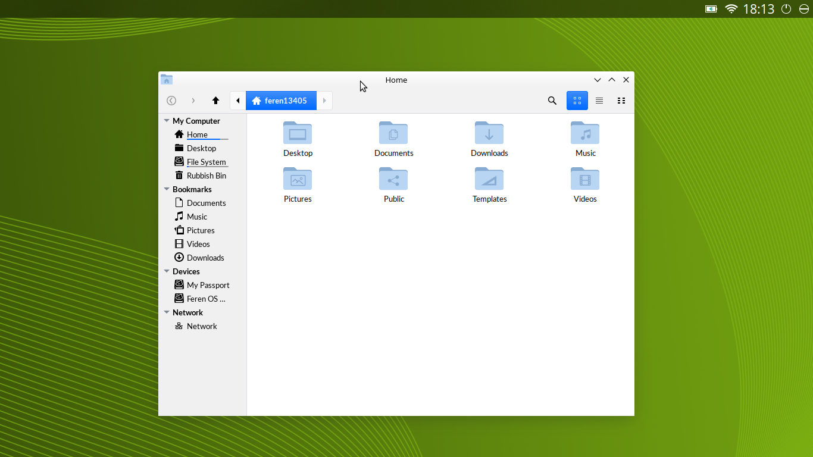

## All the work put into this has been moved into the https://github.com/feren-OS/oem-setup-shell project. Just replace any mentioning of Calamares in the code with whatever command is used for running Initial Setup in there and you should be good to go...

# Feren-PoC-Initial-Setup-Shell
A proof-of-concept Initial Setup Screen Shell using Plasma (SDDM only)

<h2>What exactly is this for?</h2>
Simply put, it's a Proof-of-concept Plasma Shell for running an Initial Config screen like GNOME's Initial Config, but without GNOME, obviously. It could come in useful for OEM Setup, and also if you removed Ubiquity and then made the OS treat every install as an 'OEM Install' ala Pop!_OS and such...

<h2>Why?</h2>
Well, I thought that any distribution development teams using a Plasma DE in their distributions might want to make use of an Initial Setup screen if it existed.

<h2>Is it complete?</h2>
No. The reason it's incomplete is because it completely lacks the Initial Setup window itself. This is, for now, literally just for building the Plasma Shell to contain a Initial Setup window that is then made by someone else. I would honestly try to make a window for it myself, but I don't know if I would ever be able to make it properly translatable from English by myself. For now it launches Nemo to be a substitute for that window.
(For anyone considering forking this, I'd change the 'nemo' command in the startup tasks argument to 'dolphin' for the first change, as it's Nemo due to being made on Feren OS KDE Experimental, where Nemo is used instead - The Feren OS Dev)

<h2>Outside of that, is there any other known issues?</h2>
Well, besides the fact some things won't work out of the box due to being designed for Feren OS 'KDE Experimental', it could be flawed in parts, security-wise (e.g.: The fact the user is given 'sudo'/Administrator), but also it has a HUGE NEED on SDDM in its current form, and also on Plasma being installed (obviously). Oh, and there's also the issue that the -second.service SystemD Service seems to die (with no fail status) without output the first time it's ran, and also that the -second.timer dies the first time it runs during bootup with error 'resources', for me, at least...

<h2>How do you 'complete' setup in this shell?</h2>
Simply create a file in /tmp/ called 'initial-setup-complete'. Assuming the SystemD Timer gets started for checking for this file when the user logs in, it should 'finish' setup and remove itself from your system shortly after that file is made.

<h2>Screenshot?</h2>
Here's a screenshot of it, in its current state: (PS: I used Spectacle to take this screenshot in a version from before Spectacle was made unusable during the time you're in this user intentionally)

